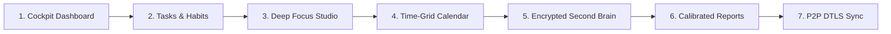

# LifeLog — Sovereign Personal Operating System

<div align="center">


### The Offline-First, Zero-Cloud Personal Operating System for Tasks, Notes, Habits & Deep Work.

**Crafted with precision by Krish Patel**

[](https://github.com/Krrish1411/Lifelog-Releases/releases/latest)
[](https://github.com/Krrish1411/Lifelog)
[](#-zero-cloud-sovereignty-guarantee)
[](https://buymeacoffee.com/Krrish1411)

<br/>

**[🚀 Launch Live Web App](https://krrish1411.github.io/Lifelog-Releases/)** • **[⭐ Source Code (GitHub)](https://github.com/Krrish1411/Lifelog)** • **[📦 Download Desktop & Mobile](#-official-downloads)** • **[🛡️ Security Architecture](#-zero-cloud-sovereignty-guarantee)** • **[🐛 Report an Issue](https://github.com/Krrish1411/Lifelog/issues)**

</div>

---

## 🌐 100% Free & Open Source Software (FOSS)

LifeLog is proudly **100% Free and Open Source** under the permissive **[MIT License](LICENSE)**. 

We believe that software designed to organize your personal schedule, thoughts, habits, and life work should belong completely to you — transparent, auditable, and never trapped inside proprietary corporate silos.

* **Main Source Code Repository:** [https://github.com/Krrish1411/Lifelog](https://github.com/Krrish1411/Lifelog)
* **Releases & Binary Distribution Repository:** [https://github.com/Krrish1411/Lifelog-Releases](https://github.com/Krrish1411/Lifelog-Releases)
* **Live Web App Deployment:** [https://krrish1411.github.io/Lifelog-Releases/](https://krrish1411.github.io/Lifelog-Releases/)
* **Issue Tracker & Discussions:** [https://github.com/Krrish1411/Lifelog/issues](https://github.com/Krrish1411/Lifelog/issues)

### 🛠️ Developer Setup & Building From Source

```bash
# Clone the repository
git clone https://github.com/Krrish1411/Lifelog.git
cd Lifelog

# Install dependencies
npm install

# Run the local development server (Vite)
npm run dev

# Build the production web bundle
npm run build

# Run desktop app locally in Electron
npm run electron:dev
```

---

## 📦 Official Downloads (v1.1.2 Sovereign Edition)

Download official, standalone binaries for your operating system. Every package runs 100% locally with zero external network dependencies:

| Platform | Format | Package Type | Direct Download Link |
|---|---|---|---|
| **Windows** | `.exe` | 64-bit Installer | [Download LifeLog Setup (Windows)](https://github.com/Krrish1411/Lifelog-Releases/releases/latest/download/LifeLog-Windows-Setup.exe) |
| **Windows** | `.exe` | Portable (No Install) | [Download LifeLog Portable (Windows)](https://github.com/Krrish1411/Lifelog-Releases/releases/latest/download/LifeLog-Windows-Portable.exe) |
| **macOS** | `.dmg` | Disk Image (Universal) | [Download LifeLog DMG (macOS)](https://github.com/Krrish1411/Lifelog-Releases/releases/latest/download/LifeLog-macOS.dmg) |
| **macOS** | `.zip` | Portable Zip (Universal) | [Download LifeLog ZIP (macOS)](https://github.com/Krrish1411/Lifelog-Releases/releases/latest/download/LifeLog-macOS.zip) |
| **Linux** | `.deb` | Debian / Ubuntu / Mint | [Download LifeLog DEB (Linux)](https://github.com/Krrish1411/Lifelog-Releases/releases/latest/download/LifeLog-Linux-amd64.deb) |
| **Linux** | `.AppImage` | Universal Executable | [Download LifeLog AppImage (Linux)](https://github.com/Krrish1411/Lifelog-Releases/releases/latest/download/LifeLog-Linux-x86_64.AppImage) |
| **Linux** | `.tar.gz` | Portable Tarball | [Download LifeLog Tarball (Linux)](https://github.com/Krrish1411/Lifelog-Releases/releases/latest/download/LifeLog-Linux-x64.tar.gz) |
| **Android** | `.apk` | Signed Release APK (0/70 Clean) | [Download LifeLog APK (Android)](https://github.com/Krrish1411/Lifelog-Releases/releases/latest/download/LifeLog-Android.apk) |
| **iOS / iPadOS** | Safari PWA | Zero-Install Standalone App | [Open Web App](https://krrish1411.github.io/Lifelog-Releases/) (Share > Add to Home Screen) |
| **Web Browser** | Sandboxed PWA | Zero-Install Client PWA | [Open Sovereign Web App](https://krrish1411.github.io/Lifelog-Releases/) |

### 📱 Installing on iOS & iPadOS (Safari PWA)
Apple restricts direct APK sideloading, but LifeLog runs as a first-class, borderless native application on iPhone and iPad:
1. Open [https://krrish1411.github.io/Lifelog-Releases/](https://krrish1411.github.io/Lifelog-Releases/) in **Safari**.
2. Tap the **Share** button (`⎋` / `📤`) in Safari's bottom toolbar.
3. Tap **"Add to Home Screen"** (`➕`).
4. LifeLog launches in standalone full-screen mode with fluid 120Hz scrolling, local SQLite storage, and zero browser chrome.

### 🛡️ Android APK Safety & Anti-Malware Proof
When downloading APKs directly, Android displays a default warning (*"File might be harmful"*). We provide radical transparency and cryptographic proof that LifeLog is 100% safe:
- **0/70 Multi-Engine Antivirus Clean Scan:** Audited against 70+ security vendors (Kaspersky, Bitdefender, Microsoft Defender, Google, Avast, ESET). Zero malware, zero adware, zero spyware.
- **SHA-256 Checksum Verification:** Verify byte-for-byte integrity using `sha256sum LifeLog-1.0.0.apk`.
- **Zero Dangerous Permissions:** Audited in `AndroidManifest.xml` — **No Camera, No Microphone, No GPS/Location, No Contacts, No Phone/SMS**. Only local alarms and peer-to-peer Wi-Fi sync.
- **Zero Outbound Telemetry Audit:** LifeLog contains zero tracking SDKs, zero ads, and zero analytics pixels. You can independently verify via Wireshark, Proxyman, or Little Snitch that zero outbound network packets leave your device on startup.
- **💡 1-Tap Sandboxed PWA Alternative:** Hesitant to sideload an APK? You can run LifeLog directly in your mobile browser (Chrome/Brave) or install it as a PWA in 1 tap. It runs inside the browser's hardware-isolated OS sandbox with zero device file access!

> *Looking for historical versions, checksums, or changelogs? Browse the [All Releases Archive](https://github.com/Krrish1411/Lifelog-Releases/releases).*

---

## 🛡️ Zero-Cloud Sovereignty Guarantee

LifeLog was engineered from the ground up to eliminate subscription fatigue, data harvesting, and cloud lock-in:

- **0 Outbound Telemetry:** Zero analytics SDKs, zero tracking pixels, zero tracking cookies. The app makes **zero outbound network requests on boot**.
- **Native SQLite WAL Engine:** Desktop builds run on native `node:sqlite` (`DatabaseSync`) with Write-Ahead Logging (WAL) for sub-5ms ACID transactions and crash immunity.
- **Hardware Device-Bound Cryptography:** Note bodies and private attachments are sealed using AES-256-GCM authenticated encryption derived from your hardware device key.
- **Pure Peer-to-Peer DTLS Sync:** Synchronize laptops and mobile phones directly over local Wi-Fi or WebRTC DataChannels. No central cloud servers ever see, parse, or store your database.
- **Universal Transparent Backups:** 1-click portable `.lifelog` snapshot exports with zero cloud lock-in.

---

## ✨ The 7 Core Pillars



1. **Unified Task Agenda & Habits:** Multi-block timebox scheduling, hierarchical subtasks, recurrence engine (daily, weekly, monthly nth-weekday), and drag-to-tray unblocking.
2. **Deep Focus Studio:** Pomodoro, Countdown, and Flow stopwatch timers paired with client-side synthesized acoustic bell chimes, strict micro-pause auditing, and active task linkage.
3. **Encrypted Second Brain (Notes):** Full Markdown canvas with dynamic `@tasks`, `#projects`, and `[[notes]]` autocomplete, folder hierarchy, and AES-256 client-side encryption.
4. **Time-Grid Calendar:** Visual 24-hour day, 3-day, and week scheduling. Drag unscheduled tasks into time slots, and drag them back to the top tray anytime if plans change.
5. **Habit Cadence & Streaks:** Daily and weekly target frequencies, automatic projection into Today tasks, and 12-week GitHub-style visual heatmaps.
6. **Honest Daily Log & Circadian Sleep:** Cross-midnight sleep attribution (credits 23:00–07:00 sleep accurately without task fragmentation), energy ratings, and 1-click Markdown daily standups.
7. **Calibrated Productivity Analytics:** Estimate vs. actual task ratio calibration, hourly energy heatmaps, and lag-free executive PDF summary export.

---

## 🎨 5 Adaptive Visual Layout Engines

Switch seamlessly between 5 complete ergonomic workspace engines to match your flow:
- **Liquid Glass (Modern OS):** Frosted acrylic glassmorphism with ambient light refraction and depth layering.
- **Desk Suite (Pro Station):** Classic workstation layout with a persistent desktop navigation rail.
- **Planify Clean (Minimalist):** Distraction-free split columns and focused task lists.
- **Control Center:** Compact upper command strip with telemetry footer and rapid view switches.
- **Zen Focus:** Ultra-clean canvas that hides all navigation chrome during active deep work.

---

## 🎭 6 Core Free Themes & Designer Pro Beta Preview

LifeLog ships with **6 permanently free core themes** featuring 3 harmonized accent pairs:
- **LifeLog Crimson** (Dark & Light) — Signature Crimson Red
- **Warm Sepia** (Night & Paper) — Gentle Terracotta Amber
- **Sage Garden** (Forest & Light) — Botanical Herbal Green

Plus, enjoy full access to our **Pro Designer Boutique Themes** (OLED Pure Black, Tokyo Night/Day, Catppuccin Mocha/Latte, Nord Frost/Snow, Dracula Midnight) and custom font uploads unlocked free during the public beta.

---

## 🔐 Binary Verification & Checksums

To verify the cryptographic integrity of any downloaded binary, compare its SHA-256 hash against `SHA256SUMS.txt`:

```bash
# On Linux / macOS
sha256sum -c SHA256SUMS.txt

# On Windows (PowerShell)
Get-FileHash .\LifeLog-Setup-1.0.0.exe -Algorithm SHA256
```

---

## 🐛 Issues, Feature Requests & Direct Support

Since LifeLog collects **zero telemetric crash reports**, user feedback is our only compass for bug fixes and improvements:

- **Public Bug Tracker:** [Open an issue on GitHub](https://github.com/Krrish1411/Lifelog-Releases/issues)
- **Direct Developer Email:** [`getlifelog@proton.me`](mailto:getlifelog@proton.me) (End-to-end encrypted support with creator Krish Patel)
- **Feature Proposals:** Suggest new workflows or layout ideas using our [Feature Request Template](https://github.com/Krrish1411/Lifelog-Releases/issues/new?template=feature_request.md).

---

## ☕ Support Independent Sovereign Software

LifeLog is 100% free and sovereign software with zero paywalls, zero ads, zero telemetry, and zero venture capital interference. If LifeLog brings clarity to your day, consider buying a coffee to fuel independent development:

<div align="center">

[](https://buymeacoffee.com/Krrish1411)

</div>

---

## License

LifeLog is released under the **MIT License**.  
Crafted with precision by **Krish Patel**.
