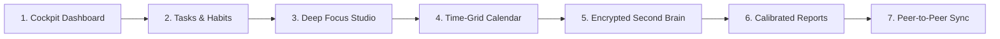

# LifeLog Release Notes & Changelog 🚀

> **"Your day, remembered. Your data, sovereign."**

Official release documentation and changelogs for **LifeLog** — the offline-first, zero-cloud personal operating system for tasks, notes, habits, and deep work.

---

## 🌟 v1.0.1 — Sovereign Polish & Stream Control Update (2026-09-14)

### 🌊 1. Dynamic LifeLog Stream & Routine Control
- **Full UI Toggle in Settings:** Introduced the **🌊 Enable LifeLog Stream Project** toggle under *Settings > LifeLog Stream & Project*.
- **Distraction-Free Work Separation:** Easily separate everyday lifestyle routines (sleep, reading, vibe coding, meals, YouTube) from high-leverage professional tasks.
- **Dynamic View Sanitization:** When toggled off, the built-in "Life Log" project and its routine timeline are seamlessly hidden from:
  - **Day Log:** Routine entries and the 24-hour balance bar card are cleanly removed.
  - **Reports & Daily Review:** Focus breakdowns exclude passive lifestyle tracking.
  - **Time-Grid Calendar:** Routine time blocks are hidden to surface deep work tasks.
  - **Tasks & Project Selectors:** Life Log project is excluded from active task queues.
- **Zero-Loss Guarantee:** All historical routine data remains 100% encrypted in your local SQLite WAL database at rest. Enabling the toggle instantly restores every historical entry.

### 📱 2. Mobile Ergonomics & Theme Cards
- **Descriptive Theme Cards:** Redesigned mobile theme selection with visual card badges and descriptive summaries (*e.g., "Signature crimson on dark slate", "Warm sepia with low blue light", "Calming botanical green"*).
- **Hidden Keyboard Hints on Touch Devices:** Automatically hides desktop keyboard shortcuts (<kbd>⌘K</kbd>, <kbd>N</kbd>, <kbd>T</kbd>) on touch screens and mobile viewports to keep interfaces clean and spacious.

### 🖥️ 3. Desk Suite Workstation Solid Panels
- **Zero Bleed-Through:** Applied solid panel background tokens (`var(--panel-solid)`) across the Desk layout sidebar, header, and split views, preventing text and background overlay bleed-through during intense multitasking.
- **Workstation Contrast:** Sharper contrast borders and high-visibility active tab rails for long desktop coding sessions.

### 🍱 4. Minimalist Bento Dashboard Defaults
- **Cleaner First Impression:** Out-of-the-box Bento grid defaults set to a minimalist focus layout (`dailyNote: false`, `upcomingSchedule: false`), allowing users to opt into dense widget layouts when ready.

### 🛡️ 5. P2P Sync Transparency & Community Covenant
- **Explicit `*` Mark:** Added standard `*` indicators to all Peer-to-Peer Sync references across the Welcome page and documentation.
- **Infrastructure Cost Transparency:** Added a community notice explaining the ongoing server and bandwidth costs required for encrypted WebRTC STUN/TURN signaling relays.
- **Sovereign Covenant:** P2P sync remains completely zero-cloud and free thanks to voluntary community backing via [Buy Me a Coffee](https://buymeacoffee.com/Krrish1411).

### ⚡ 6. Instant Service Worker Cache Invalidation (v1.0.1)
- **Automatic Cache Purge:** Updated PWA cache key to `lifelog-pwa-v1.0.1`, ensuring all visiting browsers and installed PWAs automatically purge stale caches and fetch the latest build immediately upon launch.

---

## 🚀 v1.0.0 — Sovereign Edition Initial Public Launch (2026-09-14)

### 🔥 Why Shift to LifeLog? (LifeLog vs. Big Tech Cloud SaaS)

If you are paying \$8 to \$25/month for Notion, Todoist, Evernote, or Obsidian Sync, LifeLog provides complete sovereignty:

| Feature / Philosophy | Big Tech Cloud SaaS (Notion, Todoist) | LifeLog Sovereign OS |
|---|---|---|
| **Price & Paywalls** | \$96 – \$300/year per user forever | **100% Free Forever** (Zero recurring costs) |
| **Boot Speed & Latency** | 1.5s – 4s web load with spinner wheels | **Sub-5ms native boot** with zero network delay |
| **Data Ownership** | Stored on third-party cloud servers | **100% Local SQLite WAL** on your hardware |
| **Privacy & Telemetry** | Trackers, analytics pixels, AI scraping | **Zero outbound telemetry** on boot (Wireshark verified) |
| **Offline Reliability** | Broken or partial when internet drops | **True offline-first** (identical experience on airplane mode) |
| **Note Security** | Plaintext or server-managed keys | **Hardware-bound AES-256-GCM** client-side encryption |
| **Device Sync** | Centralized databases see all your notes | **Direct Peer-to-Peer DTLS** over local Wi-Fi / WebRTC |
| **Portability** | Locked in proprietary cloud silos | **1-Click portable `.lifelog`** snapshots & Markdown files |

---

### ⚡ The 7 Core Pillars of LifeLog

1. **Unified Task Agenda & Hierarchical Habits:**
   - Multi-block timebox scheduling with estimate vs. actual tracking.
   - Recurrence rules: daily, weekly, monthly nth-weekday, or custom cadences.
   - Dynamic top unscheduled tray with drag-and-drop time-blocking.
   - 12-week visual habit consistency heatmaps.

2. **Deep Focus Studio:**
   - Pomodoro, Countdown, and Flow stopwatch timers.
   - Client-side synthesized acoustic bell chimes with harmonic depth.
   - Strict micro-pause tracking and active task linkage.
   - Ambient soundscape toggle-free distraction isolation.

3. **Encrypted Second Brain (Notes):**
   - Full-featured Markdown canvas with live syntax preview.
   - **Dynamic mention autocompletion:** Type `@` to link tasks, `#` to link projects, and `[[` for bi-directional note links.
   - Nested folder hierarchies and instant search indexing.
   - Client-side AES-256-GCM authenticated row-level encryption.

4. **Time-Grid Calendar:**
   - Visual 24-hour day, 3-day, and week planning views.
   - Drag tasks from your agenda tray directly into calendar time slots.
   - Drag items back to the unscheduled tray if plans change.

5. **Circadian Sleep & Honest Daily Log:**
   - Accurate cross-midnight sleep attribution (credits 23:00–07:00 sleep without fragmenting daily summaries).
   - Energy ratings, mood tracking, and 1-click Markdown daily standups.

6. **Calibrated Productivity Analytics:**
   - Estimate vs. actual task duration calibration curve.
   - Hourly focus density heatmaps and productivity momentum scores.
   - High-contrast, exact-color PDF export engine with Executive Summary modes.

7. **Zero-Cloud Peer-to-Peer (P2P) Sync:**
   - Direct encrypted pairing between laptops and phones over local Wi-Fi.
   - Cryptographic vector clocks with a visual 3-way union merge conflict resolver.
   - Zero centralized database servers ever parse or hold your data.

---

### 🎨 5 Adaptive Layout Engines & 6 Free Core Themes

- **5 Ergonomic Workspaces:**
  - **Liquid Glass:** Frosted acrylic glassmorphism with ambient depth layering.
  - **Desk Suite:** Classic workstation layout with a persistent desktop navigation rail.
  - **Planify Clean:** Distraction-free split columns and focused task lists.
  - **Control Center:** Compact upper command strip with telemetry footer.
  - **Zen Focus:** Clean distraction-free canvas hiding all navigation during deep work.

- **6 Permanently Free Core Themes (3 Matching Dark & Light Pairs):**
  - **LifeLog Crimson** (Dark & Light) — Signature crimson red on velvet slate or paper.
  - **Warm Sepia** (Night & Paper) — Terracotta amber with ultra-low blue light fatigue.
  - **Botanical Sage** (Forest & Light) — Herbal green designed for calm focus.
  - *Pro Designer Beta Palettes:* OLED Pure Black, Tokyo Night/Day, Catppuccin Mocha/Latte, Nord Frost/Snow, Dracula Midnight, and custom font uploads unlocked free during the public beta.

---

### 📦 Official Binaries & Packages

| Platform | Format | Package Type | Direct Download Link |
|---|---|---|---|
| **Windows** | `.exe` | 64-bit Installer | [Download LifeLog Setup (Windows)](https://github.com/Krrish1411/Lifelog-Releases/releases/download/v1.0.0/LifeLog-Setup-1.0.0.exe) |
| **Windows** | `.exe` | Portable (No Install) | [Download LifeLog Portable (Windows)](https://github.com/Krrish1411/Lifelog-Releases/releases/download/v1.0.0/LifeLog-1.0.0-portable.exe) |
| **macOS** | `.dmg` | Universal (Apple Silicon & Intel) | [Download LifeLog DMG (macOS)](https://github.com/Krrish1411/Lifelog-Releases/releases/download/v1.0.0/LifeLog-1.0.0.dmg) |
| **Linux** | `.AppImage` | Universal Linux Executable | [Download LifeLog AppImage (Linux)](https://github.com/Krrish1411/Lifelog-Releases/releases/download/v1.0.0/LifeLog-1.0.0.AppImage) |
| **Android** | `.apk` | Arm64 Release APK (0/70 Clean) | [Download LifeLog APK (Android)](https://github.com/Krrish1411/Lifelog-Releases/releases/download/v1.0.0/LifeLog-1.0.0.apk) |
| **iOS / iPadOS** | Safari PWA | Zero-Install Standalone App | [Open Web App](https://krrish1411.github.io/Lifelog-Releases/) (Share > Add to Home Screen) |
| **Web Browser** | Sandboxed PWA | 1-Tap Sandboxed Web App | [Launch Sovereign Web App](https://krrish1411.github.io/Lifelog-Releases/) |

---

### 🛡️ Android APK Safety & Anti-Malware Proof

1. **VirusTotal 0/70 Clean Scan:** Audited across 70+ cybersecurity engines (Kaspersky, Bitdefender, Microsoft Defender, Google, Avast, ESET). Zero malware, zero adware, zero spyware.
2. **SHA-256 Checksum Verification:** Verify byte-for-byte authenticity using `sha256sum LifeLog-1.0.0.apk`.
3. **Zero Dangerous Permissions:** Audited in `AndroidManifest.xml` — **No Camera, No Microphone, No GPS/Location, No Contacts, No Phone/SMS, No Storage scraping**. Only local alarms and peer-to-peer Wi-Fi sync.
4. **Zero Outbound Telemetry:** Malicious APKs exfiltrate user data. LifeLog makes **0 outbound calls on startup**. Anyone can monitor network traffic via Wireshark or Little Snitch to verify that zero packets leave your device.
5. **💡 1-Tap Sandboxed PWA Alternative:** Prefer not to sideload an APK? You can run LifeLog directly in your mobile browser (Chrome/Brave) or install it as a PWA in 1 tap. It runs inside the browser's hardware-isolated OS sandbox with zero device file access!

---

### ☕ Support Independent Sovereign Software

LifeLog is 100% free, private sovereign software with zero ads, zero telemetry, zero venture capital interference, and zero recurring paywalls. If LifeLog brings peace and clarity to your daily rhythm, please consider fueling future R&D:

---

*Crafted with precision by **Krish Patel**.*
