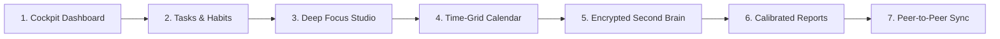

# LifeLog Release Notes & Changelog 🚀

> **"Your day, remembered. Your data, sovereign."**

Official release documentation and changelogs for **LifeLog** — the offline-first, zero-cloud personal operating system for tasks, notes, habits, and deep work.

## 🌟 v1.1.8 — Android Notification Stability, Swipe-to-Dismiss, Inter Normal Default Font & Calendar-Day Update Check (2026-09-23)

### 📱 1. Android Notification Stability & Zero Spam
- **Eliminated Repetitive 10s Re-posting:** Removed the background JavaScript interval loop from `initRunningTimerTrayListener` that caused 5–7 duplicate notifications per minute in Android's notification history.
- **Hardware-Level OS Chronometer:** Android OS native Chronometer handles second-by-second countdown and count-up rendering directly in the system UI and lock screen without re-posting notifications or waking the CPU.
- **No More Blinking / Flickering:** Active timer notifications are posted once on backgrounding, updated once on state changes (pause/resume), and cleanly dismissed when stopped.

### 👆 2. Swipe-to-Dismiss Notifications
- **User-Controlled Dismissal:** Changed running timer notifications from `ongoing: true` to `ongoing: false` and enabled `autoCancel: true`. Users can now swipe away the notification from their notification shade whenever they want.

### 🎨 3. Universal Inter Normal Default Typography
- **Inter Font Integration:** Imported Google Fonts `Inter` (weights 400, 500, 600, 700) in `index.html`.
- **Universal Default Font:** Configured `Inter` as the universal default across `--font-body` and `--font-display`, `DEFAULT_SETTINGS.fontPair`, and automatic migration for existing user sessions. All headings, body, notes, cards, and modal components inherit crisp, clean Inter typography.
- **Typeface Picker:** Added `Inter (default)` to Settings > Typeface with 1-click switching.

### ⚡ 4. Calendar-Day Startup Update Check (< 1 KB Bandwidth)
- **Once-per-Calendar-Day Check:** Replaced millisecond interval checks with `new Date().toISOString().slice(0, 10)` calendar date comparison in `localStorage`. The update check runs exactly once on the first app launch of each day and silently skips subsequent opens.
- **Minimal Bandwidth Usage (< 1 KB):** Releases descriptor (`version.json`) is under 2.6 KB uncompressed (< 1 KB compressed). Monthly bandwidth consumption is ~25 KB to 50 KB (less than loading half a website image in an entire month).
- **Fast Failover:** Optimized `fetchRemoteVersionInfo()` to immediately return upon primary URL success without querying fallback URLs.

---

## 🌟 v1.1.7 — Android Notification Silence & Polish, Mandatory Task Binding, Google Calendar Side-by-Side & Schedule Alignment (2026-09-22)

### 📱 1. Android Notification Silence & Polish
- **Eliminated Sound & Vibrate Loops:** Injected `/* LifeLog Silent Channel Guard */` into Kotlin `LocalNotificationManager.kt` via `scripts/patch-local-notifications.js` to enforce `mBuilder.setSound(null)`, `mBuilder.setDefaults(0)`, `mBuilder.setVibrate(null)`, `mBuilder.setNotificationSilent()`, and `mBuilder.setOnlyAlertOnce(true)`. Migrated running timers to `focus-running-silent-v5`.
- **Restored Native Android Progress Bar:** Omitted `NotificationCompat.BigTextStyle` from running notifications to prevent Android from obscuring the native OS progress bar (`mBuilder.setProgress(100, pct, false)`).
- **Native Chronometer Count-Up for Flow:** Flow focus sessions natively count up in the notification shade using `setChronometerCountDown(false)`.
- **Fixed Sticky Notification (Unswipeable):** Added `FLAG_ONGOING_EVENT` and `FLAG_NO_CLEAR` flags.
- **Clean Aesthetic Typography:** Removed duplicate text ("Focus - AFM \n AFM \n status deep focus active") in favor of concise task titles and modern progress text (`AFM`, `24:15 left · [██████░░░░] 60%`).

### 🎯 2. Mandatory Task Binding & UI Cleanup
- **Mandatory Task Selection:** Focus sessions across Pomodoro, Countdown, and Flow cannot be started without selecting an assigned task in both Focus view and the desktop Timer Popout.
- **Removed Cluttering Link / Change Chips:** Completely stripped distracting "+ Link Task" and "Change" chips from Day Log, Reports, and Focus stage. Day Log remains a clean, read-only audit log.
- **Dedicated Session Editor (`EditSessionModal`):** Mounted exclusively via a small `<Pencil size={11} />` edit button on past sessions in Today's Focus Log and clickable focus blocks in Calendar, allowing task reassignment, duration adjustments (with 15m/25m/45m/60m chips), and start/end time edits.

### 📅 3. Google Calendar Side-by-Side Columns & Dynamic Timeline Sync
- **Side-by-Side Overlapping Columns:** Implemented `layoutOverlappingBlocks` partitioning intersecting tasks into parallel columns (`| Task 1 | Task 2 |`) across the full width of each day column.
- **Dynamic Focus Sessions & Pauses on Calendar:** Executed focus sessions appear directly on the calendar timeline with pause counts, duration, and done states, deduplicating against any pre-scheduled block for the same task.
- **Accurate Drag Previews & 15m Resizing:** Dragging 2-hour or 30-minute tasks from the tray or grid previews the exact duration height (fixing the 1-hour placeholder). Added interactive bottom-edge handles for 15-minute duration resizing.

### 🔀 4. Schedule Conflict & Alignment Modal
- **Automatic Alignment Dialog:** When an unscheduled focus session overlaps a pre-scheduled task slot, `ScheduleConflictModal` provides 1-click resolution:
  1. *Push conflicting task forward* (moves it past the focus session).
  2. *Move conflicting task to Unscheduled Tray* (leaves time free).
  3. *Keep both in calendar* (displays both side-by-side as `| Task 1 | Task 2 |`).
  4. *Pick custom reschedule time*.
  5. *Dismiss / Don't change schedule*.

### ⏱️ 5. Uncapped Focus Duration & True Overtime Tracking
- **Eliminated Premature Session Truncation:** Re-engineered the session watchdog so work sessions (`mode !== "break"`) are never automatically frozen or truncated to the planned time.
- **Real-Time Overtime Counter (+MM:SS):** Added glowing overtime indicator and dedicated "Finish" button across the full-screen stage and Timer Popout. Adding 15 minutes to a 50m session and working 1h 10m+ accurately records the full 1h 10m+ in reports and Day Log.

---

## 🌟 v1.1.6 — Rhythm of Time Accuracy, Universal Markdown Top-Row Shortcuts, Stealth Popout & Instant Android Notifications (2026-09-21)

### 🕒 1. Accurate Rhythm of Time & Active Hour Slicing
- **Pause-Exclusion Interval Slicing:** Fixed hourly time-of-day distribution in Reports by introducing `getSessionActiveIntervals(s, now)`. Paused time spans are completely excluded from hourly activity buckets. If a user tracks a 4-hour session with 2 hours of pause, Reports accurately attributes only the 2 genuine active focus hours.
- **Dynamic Real-Time Live Ticking across All Views:** Connected `liveTick` into `useMemo` dependency arrays across `Reports.tsx`, `Dashboard.tsx`, `DayLog.tsx`, and `Review.tsx`. Focus minutes, today's totals, and charts dynamically tick live every second without requiring view switching.

### ⌨️ 2. Universal Markdown Shortcuts & Smart Caret Placement
- **Top-Row Number Support:** Resolved shortcut failures on standard keyboards where top-row digits emit shifted characters (<kbd>Ctrl+Shift+1</kbd> -> `!`, <kbd>2</kbd> -> `@`, <kbd>3</kbd> -> `#`, <kbd>8</kbd> -> `*`, <kbd>.</kbd> -> `>`) by matching `e.code` (`Digit1`, `Digit2`, `Digit3`, `Digit8`, `Period`).
- **Seamless Caret Auto-Placement:** Switching from Preview to Write tab automatically focuses the textarea, inserts a trailing newline if needed, and positions the caret at the very end of content. Opening blank notes automatically focuses the editor at the top.

### 🎵 3. Resilient Audio Synthesis & Universal Break Offers
- **AudioContext Auto-Resumption:** Introduced `withActiveAudioContext` to reliably resume suspended Web Audio contexts before synthesizing tone cues for pause, resume, and stop across Focus view, floating popout, and the bottom mini-timer bar.
- **Universal Break Offers on Stop:** Manually stopping any timer universally presents 1-click break offers (+5m / +15m) across all timer interfaces.

### 🖥️ 4. Stealth Desktop Popout & Tray Backgrounding
- **Alt+Tab Exclusion:** Opening the floating popout completely hides the main window from the desktop window manager and Alt+Tab switcher (`mainWindow.hide()`), keeping the workspace clean.
- **Close to System Tray:** Closing the main window (`X`) minimizes to the system tray with memory and V8 cache trimming (`trimMemory`), preventing accidental termination while keeping resource usage ultra-low.

### 📱 5. Instant Android Lock Screen Notifications & Battery Conservation
- **0ms Instant Notification Delivery:** Removed artificial schedule delays, dispatching notifications immediately through `notificationManager.notify()` on start, pause, resume, and stop.
- **Lock Screen Visibility Bypass:** Patched `@capacitor/local-notifications` to enforce `NotificationCompat.VISIBILITY_PUBLIC`, guaranteeing that focus timers, task titles, and action buttons appear on the lock screen even when Android OS "Hide sensitive notifications" is enabled.
- **Aesthetic Formatting & Text Progress Bar:** Modern notification presentation displaying task title as the primary header, text progress bar `[██████░░░░] 60%`, clean action buttons (`⏸ Pause`, `▶ Resume`, `⏹ Stop`), and dedicated monochrome status bar vector icon (`ic_stat_lifelog.xml`).
- **Low-Power Background Heartbeat:** 10-second battery-saving update interval while minimized, with instantaneous 0ms visual updates on interactive button taps.

---

## 🌟 v1.1.5 — Real-Time Live Ticking, Multi-Pause Branch Timeline, Notes Markdown Shortcuts & Sovereign Encrypted Storage (2026-09-21)

### ⚡ 1. Dynamic Real-Time Live Ticking Engine
- **1-Second Dynamic Heartbeat:** Added an active 1000ms ticker (`liveTick`) to application state whenever any session is running.
- **Zero-Switch Reactive Dashboard:** Focus minutes, daily progress meters, and report charts update live on screen every second without requiring users to switch tabs or refresh.

### 🌿 2. Multi-Pause Session Branch Timeline & Visual Segmented Bar
- **Proportional Segmented Interval Bar:** Displays a visual colored bar showing active focus periods (emerald) and pauses (amber) with interval duration tooltips.
- **Expandable Vertical Branch-Tree Diagram:** Fully plots complex multi-pause sessions tracking exact start time, pause intervals (e.g., `11:45 AM → 12:15 PM`), duration badges, resume timestamps, and net focus duration across unlimited pauses.
- **Universal Integration:** Active in Day Log session lists, Focus view "Today" history, and Reports.

### 📊 3. Deep Pause Analytics & Focus Efficiency Inspector
- **Dedicated Pause Diagnostics:** Reports now feature a comprehensive Pause Analytics widget tracking average pause duration, shortest pause, longest pause, continuous flow sessions (0 pauses), and overall focus efficiency percentage (`netFocus / totalSpan`).

### 📝 4. Notes Editor Stability, Caret Preservation & Direct .md Export
- **Autosave Cursor Jump Fix:** Resolved race condition in debounced autosave that wiped draft text and re-decrypted asynchronously mid-sentence. Cursor stays locked to caret position.
- **Viewport Reset:** Notes open pinned cleanly to top (`scrollTop = 0, caret = 0`).
- **Direct 1-Click .md Export:** Export any decrypted note instantly as a standard `.md` file for use in Obsidian or any Markdown editor.
- **Sovereign Encrypted SQLite Storage:** Preserved client-side AES-256-GCM authenticated encryption; zero unencrypted plaintext files dumped to disk.

### ⌨️ 5. Markdown Formatting Keyboard Shortcuts & Cheatsheet
- **Rich Editor Shortcuts:** Added <kbd>Ctrl+B</kbd> (Bold), <kbd>Ctrl+I</kbd> (Italic), <kbd>Ctrl+U</kbd> (Underline), <kbd>Ctrl+Shift+X</kbd> (Strikethrough), <kbd>Ctrl+Shift+H</kbd> (Highlight), <kbd>Ctrl+Shift+C</kbd> (Inline Code), <kbd>Ctrl+Shift+T</kbd> (Checklist Todo `- [ ] `), <kbd>Ctrl+Shift+1/2/3</kbd> (Headings), <kbd>Ctrl+Shift+8</kbd> (Bullet list), <kbd>Ctrl+Shift+.</kbd> (Blockquote), <kbd>Ctrl+K</kbd> (Link), and <kbd>Ctrl+S</kbd> (Save).
- **On-Screen Cheatsheet Modal:** Interactive `?` button opens a complete Markdown syntax and shortcuts cheat sheet.

### ⏱️ 6. Focus Popout Lifecycle, Universal Breaks & Memory Trimming
- **Auto-Finalization at 0:00:** Popout cleanly transitions to `status: "done"` when countdown ends; no stuck screen.
- **Universal Completion & Break Card:** Offers 1-click +5m and +15m breaks across Pomodoro, Countdown, and Flow.
- **IPC Window Management & RAM Optimization:** Minimizes main window and trims memory on popout open; restores and focuses main window via IPC on demand.
- **Acoustic Downward Stopping Chime:** Soothing resolving downward chime (440Hz &rarr; 220Hz decay) on Stop across all timer interfaces.

### 🔤 7. System Default Native OS Font
- Added `"system"` font pair option in Settings rendering the native OS font stack (`system-ui, -apple-system, BlinkMacSystemFont, 'Segoe UI', Roboto, Ubuntu, Cantarell, sans-serif`).

### 🌊 8. Reports Life Log Segregation & Deduplication
- **Pure Deep Work Metrics:** Cleanly separated genuine work sessions (`!isLifeTask`) from Life Log routine streams.
- **Zero Double-Counting:** Life Balance strictly accounts for activities once (`totalAllMin = totalMin + lifeMin`) without duplicating tracked sessions.
- **Removed Ghost +30m Fallback:** Eliminated arbitrary 30-minute additions for routine checklist items lacking duration.
- **Purified Work Deliverables & Calibration:** Filtered `LIFE_LOG_PROJECT_ID` out of completed work deliverables, project breakdown, estimate vs. actual, and calibration tables, keeping deep work metrics authentic.

### 📱 9. Android Public Lockscreen Notifications & Interactive Controls
- **Public Lockscreen Visibility:** Registered channels `focus-running-channel-v3` and `focus-alarm-channel-v3` with explicit `visibility: 1` (`VISIBILITY_PUBLIC`), ensuring Android lock screens render the notification regardless of the device OS setting *"Don't show sensitive notifications on lock screen"*.
- **Dynamic Title & Time Formatting:** Live formatting as `🎯 Focus · MM:SS: <Task Name>` (or `⏸️ Paused (MM:SS): <Task Name>`) across lock screen and notification shade.
- **Interactive Action Buttons:** Direct 1-tap `⏸️ Pause` / `▶️ Resume` and `⏹️ Stop` action buttons right from the lockscreen and shade without opening the app.
- **Background Ticking Heartbeat:** 5-second periodic update interval keeping the notification countdown accurate while the device is locked.

### 🖥️ 10. Linux / Desktop Window Restoration & System Tray Indicator
- **Single-Instance Restoration:** Launching LifeLog from desktop application menus or running `lifelog` while a session is running immediately restores, un-minimizes, and focuses the existing window.
- **System Tray App Indicator:** Permanent 22×22px system tray indicator with click-to-restore and quick action menu ("Open LifeLog", "Open Floating Timer", "Quit LifeLog").

### 🚀 11. Tag-Only Workflow Execution
- Restricted GitHub Actions pipelines strictly to version tags (`tags: [ "v*" ]`) or manual `workflow_dispatch`, completely eliminating unintentional CI/CD runs on branch pushes.

---

## 🌟 v1.1.4 — Instant Zero-Debounce Real-Time Sync, Dynamic Timer Reactivity & Multi-Relay Fan-Out (2026-09-18)

### ⚡ 1. Instant Zero-Debounce Delta Synchronization (<150ms)
- **Zero-Debounce Priority Pipeline:** Interactive user actions (starting a timer, pausing, resuming, extending `+5m`, stopping, checking off tasks, or deleting tasks) now dispatch an immediate lightweight `DELTA_STATE` packet with **0ms debounce**.
- **Ultra-Compact Payloads (<400 Bytes):** Instead of serializing and decrypting the entire database across the network, delta updates transmit only the modified entity. Payloads easily fit under relay thresholds (<4096 bytes), avoiding disk attachment conversions and secondary HTTP fetches. Over WebRTC DataChannels, packets arrive in `<20ms`; over relay SSE streams, in `<80ms`.
- **Background Eventual-Consistency Net:** A debounced (800ms) full-state sync continues to run in the background, guaranteeing that complex state transitions and edge cases are always perfectly aligned.

### ⏱️ 2. Dynamic Timer Reactivity & Real-Time Pause Sync
- **Frozen Timestamp Synchronization:** Pausing a timer on one device immediately broadcasts the open pause interval (`{ at: ts, resumeAt: null }`), instantly freezing the elapsed countdown/timer on all secondary devices in real time.
- **Monotonic Timestamp Tracking:** Added `updatedAt` tracking across all session lifecycle events (`pause`, `resume`, `start`, `stop`, `extend`), ensuring Last-Write-Wins (LWW) deterministic reconciliation without clock drift.
- **Strict Single-Running-Session Sanitization:** Implemented `sanitizeSessions()`, guaranteeing that across the entire session list, only the single most recently active session can have `status: "running"`. Starting a new session automatically terminates any lingering running sessions.

### 🛡️ 3. Parallel Relay Fan-Out & Split-Brain Elimination
- **Simultaneous Multi-Relay Delivery:** Outgoing relay packets are transmitted across all healthy candidate relay servers (`ntfy.envs.net` and `ntfy.sh`) in parallel. Regardless of which relay node a receiving device is connected to, messages arrive instantly.
- **Deduplication:** Automatic message ID tracking deduplicates packets so receivers never process duplicate payloads.

### 🔄 4. Automatic WebRTC DataChannel Upgrade on Reconnect
- **Background SDP Offer/Answer Exchange:** When paired devices relaunch or resume from background, the host automatically generates a WebRTC SDP offer over the relay channel. The joiner creates an SDP answer, automatically upgrading the connection from relay to direct peer-to-peer WebRTC DataChannel whenever NAT topology permits.

---

## 🌟 v1.1.3 — Google STUN Direct P2P Sync, Multi-Relay Failover & Zero-Spam Keepalive (2026-09-17)

### ⚡ 1. Direct Peer-to-Peer WebRTC over Google STUN
- **Direct Device-to-Device Transfer:** 6-digit PIN pairing now negotiates direct WebRTC DataChannel connectivity over Google STUN (`stun.l.google.com:19302`) during handshake. Once paired, all notes, tasks, habits, and delta broadcasts stream peer-to-peer over direct UDP/TCP with **zero server load, zero quota consumption, and sub-20ms latency**.
- **Universal Multi-Network Operation:** Direct hole punching connects devices seamlessly across different networks, cellular mobile data (4G/5G), and Wi-Fi without needing a local LAN.

### 🛡️ 2. Encrypted Multi-Relay Redundancy & Automatic Failover
- **Independent High-Availability Relays:** Introduced multi-relay failover architecture with `https://ntfy.envs.net` (primary) and `https://ntfy.sh` (secondary backup).
- **Zero-Failure Handshake:** Session metadata is mirrored across candidate relays. If one node experiences network hiccups or rate limits, LifeLog switches immediately and automatically to the healthy node.
- **Relay Fallback Safety Net:** If carrier-grade symmetric NAT blocks direct WebRTC UDP holes, the encrypted relay takes over smoothly in the background.

### 🔇 3. Zero-Spam SSE Keepalive & Rate Limit Elimination
- **Eliminated Rapid PING Spam:** Removed the aggressive 10-second PING/PONG HTTP requests and 15-second reconnection loop that exhausted public relay quotas.
- **Passive SSE Streaming:** Persistent Server-Sent Events (SSE) stream maintains listening status with single-request keepalive.
- **Intelligent Broadcast Debounce:** Real-time state broadcasting intelligently throttles HTTP requests (1200ms debounce on relay, 400ms on WebRTC), protecting battery life, data bandwidth, and server limits.

### 🎯 4. Reliable Handshake & Ghost Connection Resolution
- **Accurate Connection Transitions:** Auto-reconnect cleanly marks state as `connecting` and only transitions to `connected` upon verified cryptographic peer handshake.
- **Handshake Peer Preservation:** Fixed race condition where peer identity was wiped during initial handshake packet reception.

---

## 🌟 v1.1.2 — Database Anti-Resurrection, Cross-Platform SQLite Reconciliation & Persistent P2P Sync (2026-09-17)

### 🛡️ 1. Permanent SQLite Deletion & Anti-Resurrection Architecture
- **Atomic Deletion Purging:** Resolved critical database persistence flaw where deleting notes, tasks, habits, projects, or folders in the UI only updated in-memory state while SQLite indefinitely preserved orphaned rows with `is_deleted = 0`.
- **Universal Multi-Layer Reconciliation:** On every persist cycle, `saveFullStateToDb` reconciles every SQLite table (`tasks`, `notes`, `attachments`, `habits`, `projects`, `folders`, `sessions`, `day_logs`) against active application state, atomically deleting all deleted rows.
- **Immediate UI Deletion Routing:** Frontend deletion actions across all views immediately invoke `deleteFromDb` to purge records from SQLite before debouncing.
- **Cascading Attachment Cleanup:** Deleting a note automatically cascades to purge its encrypted binary attachments from SQLite storage.

### 🔄 2. Persistent P2P Device Sync & Auto-Reconnect Architecture
- **Non-Destructive Background Heartbeat:** Heartbeat timeouts (>26s peer silence) and background network drops no longer destroy saved pairing credentials (`SYNC_STORAGE_KEY`). Devices remain paired across restarts and sleep states.
- **Silent Auto-Reconnect Engine:** LifeLog automatically queries saved pairing sessions on launch and runs an automatic 15-second reconnection loop to seamlessly resume encrypted relay sync whenever peers come online.
- **Deterministic Cryptographic Tombstones:** All deletion events generate deterministic Unix millisecond tombstones (`deleted.notes`, `deleted.tasks`, `deleted.habits`, `deleted.projects`), preventing two-way state reconciliation from resurrecting deleted records.
- **Explicit Disconnect Action:** Pairing credentials are now only cleared when the user explicitly clicks "Disconnect" in the Sync dialog.

### 🧹 3. Total Database Wipe Support
- **Full Database Reset:** "Erase LifeLog on this device" in Settings now executes a complete database wipe (`DELETE FROM ...` across all tables + `VACUUM` + removal of disk fallback JSON vaults), guaranteeing a true factory-clean slate.

---

## 🌟 v1.1.1 — Smart Platform-Filtered Updates, Daily Auto-Check & Release Sync (2026-09-15)

### 🎯 1. Smart Platform-Filtered Update Detection
- **Distribution-Specific Update Targeting:** LifeLog now detects your exact operating system and application distribution (`windows-portable`, `windows-setup`, `linux-appimage`, `linux-deb`, `mac`, `android`, or `web`).
- **Single-Click Matching Binary:** Instead of overwhelming users with multi-platform download lists, the update modal displays **only the exact binary matching your current installation** (e.g. Windows Portable users see a single dedicated button to download the Portable executable).
- **Universal Release Hub Navigation:** Direct link to the complete GitHub Releases page (`https://github.com/Krrish1411/Lifelog-Releases/releases/latest`) for users seeking checksums, source archives, or alternative formats.

### ⏰ 2. Automated Daily Update Check & Auto-Popup
- **Silent Background Verification:** LifeLog automatically checks for new releases on startup once every 24 hours without sending tracking data or telemetry.
- **Automatic Pop-up Notification:** When a new version is detected, the **Update Available window automatically pops up on screen** with the latest changelog and the matching download button.
- **Unified Checker Architecture:** The manual "Check for Updates" button in Settings and the daily startup check share the same robust, timeout-guarded update engine (`src/utils/updater.ts`).

### 🔗 3. Canonical Releases Repository Synchronization
- **Live Branch Sync:** Synchronized `version.json` on the `main` branch of `Krrish1411/Lifelog-Releases` with verified asset filenames, resolving legacy 404 errors for all existing v1.0.0 and v1.0.2 users.

---

## 🌟 v1.1.0 — Open Source Milestone, Mobile Responsive Focus Scroll & Clean Multi-Platform Binaries (2026-09-15)

### 🌐 1. 100% Free & Open Source Milestone (MIT License)
- **Public Core Codebase:** LifeLog is now 100% free and open source under the permissive MIT License. Full source code, build toolchains, and issue discussions are publicly accessible at [https://github.com/Krrish1411/Lifelog](https://github.com/Krrish1411/Lifelog).
- **Public Audibility & Zero Telemetry:** Verify independently that zero tracking SDKs, zero ads, zero telemetry, and zero remote database connections exist in the codebase.
- **Developer Quickstart:** Added developer clone, local build, and testing documentation in `README.md` (`npm run dev`, `npm run build`, `npm run electron:dev`).

### 📱 2. Mobile Responsive Touch Scrolling on Focus Screen
- **Full-Screen Touch Response:** Fixed touch-gesture interception on mobile screens across all 3 focus cards. Swiping or dragging with a finger anywhere inside the Focus cards (including the 240px SVG timer circle and task lists) now scrolls the page naturally.
- **Touch-Action Scoping:** Declared `touch-action: pan-y` across card components and `.engine-panel` in `index.css`, preventing browser gesture locks and overscroll trapping.
- **Pointer Events Optimization:** Set `pointer-events: none` on the non-interactive SVG timer dial and center digit overlay, ensuring vertical swipes seamlessly pass through to document scrolling on phones.

### 📦 3. Clean Multi-Platform Binary Separation
- **Distinct Platform Packages:** Binaries are now built, clearly named, and published separately so users can download their exact preference:
  - **Linux:** `.deb` (Debian/Ubuntu/Mint), `.AppImage` (Universal Linux), `.tar.gz` (Portable Linux).
  - **Windows:** `LifeLog-Setup-Windows.exe` (Installer), `LifeLog-Portable-Windows.exe` (Standalone Portable).
  - **macOS:** `LifeLog-macOS.dmg` (Disk Image), `LifeLog-macOS.zip` (Portable Archive).
  - **Android:** `LifeLog-Android.apk` (Signed Release APK).

### ⚡ 4. Service Worker Cache Update & Storage Quota Protection
- **Instant PWA Cache Invalidation:** Bumped service worker cache key to `lifelog-pwa-v1.1.0` with active `controllerchange` listener for seamless automatic browser refreshes.
- **1-Day Storage Retention:** All CI build workflows configured with `retention-days: 1` to keep Actions artifact storage at zero bloat.

---

## 🌟 v1.0.2 — Mobile Scroll Architecture, Version Dynamic Sync & Cloud Automation (2026-09-14)

### 📱 1. Mobile Touch Architecture & Focus Page Fluid Scrolling
- **Mobile-First Priority:** Reordered the Focus page layout on mobile screens (`< 1024px`). The **Timer Card is now positioned right at the top** (`order-1`), followed by the Task Selector (`order-2`) and Today's History (`order-3`). Users on Android and mobile viewports can immediately start, pause, or switch modes without having to scroll past 420px of task lists.
- **Universal Mobile Touch Scroll Fix:** Removed the aggressive global `overscroll-behavior-y: contain` property on `.overflow-y-auto` and `main` in `index.css`. Previously, touching any element on Android with an internal scroll container would completely freeze outer page scrolling. Overscroll containment is now strictly scoped to actual dialogs and drawers (`.modal, [role="dialog"], .drawer`).
- **Fluid Viewport Heights:** Replaced rigid `min-h-[calc(100vh-140px)]` on mobile with fluid responsive heights (`min-h-full pb-16 lg:h-[calc(100vh-140px)]`), eliminating clipped controls and viewport locking on mobile devices.

### 🔄 2. Dynamic Version Synchronization
- **Single Source of Truth:** Connected `package.json` (`v1.0.2`) directly to Vite's build-time define system (`__APP_VERSION__`), guaranteeing that the UI never displays outdated version strings.
- **Live In-Browser Version Verification:** `Settings` view now dynamically auto-queries `./version.json` in web mode, instantly reflecting active deployed versions without requiring manual hardcode edits.
- **Android Gradle Version Alignment:** Synced `versionCode 5` and `versionName "1.0.2"` in `android/app/build.gradle`.

### ⚡ 3. Instant PWA Service Worker Cache Invalidation (v1.0.2)
- **Automatic Cache Purge:** Updated PWA cache key to `lifelog-pwa-v1.0.2`. Browsers and installed PWAs automatically purge stale caches and fetch the fresh mobile-scroll build upon opening.

### 🚀 4. Zero-Bandwidth Cloud Release Pipeline (GitHub Actions)
- **Automated Cloud Compiles:** Updated `.github/workflows/build-apk.yml` and `.github/workflows/build-electron.yml` to trigger automatically on git release tags (`v*`).
- **Direct GitHub Release Asset Attachment:** GitHub's cloud runners now compile Android APKs, Linux AppImage/deb, Windows executables, and macOS packages in Microsoft's multi-gigabit cloud and attach them directly to the GitHub Release.
- **Zero Local Data Consumption:** You no longer need to spend gigabytes downloading or re-uploading large binaries locally; a single ~2 KB `git push origin v1.0.2` triggers the entire cloud release process.

---

## 🌟 v1.0.1 — Sovereign Polish & Stream Control Update (2026-09-14)

### 🌊 1. Dynamic LifeLog Stream & Routine Control
- **Full UI Toggle in Settings:** Introduced the **🌊 Enable LifeLog Stream Project** toggle under *Settings > LifeLog Stream & Project*.
- **Distraction-Free Work Separation:** Easily separate everyday lifestyle routines (sleep, reading, vibe coding, meals, YouTube) from high-leverage professional tasks.
- **Dynamic View Sanitization:** When toggled off, the built-in "Life Log" project and its routine timeline are seamlessly hidden from:
  - **Day Log:** Routine entries and the 24-hour balance bar card are cleanly removed.
  - **Reports & Daily Review:** Focus breakdowns exclude passive lifestyle tracking.
  - **Time-Grid Calendar:** Routine time blocks are hidden to surface deep work tasks.
  - **Tasks & Project Selectors:** Life Log project is excluded from active task queues.
- **Zero-Loss Guarantee:** All historical routine data remains 100% encrypted in your local SQLite WAL database at rest. Enabling the toggle instantly restores every historical entry.

### 📱 2. Mobile Ergonomics & Theme Cards
- **Descriptive Theme Cards:** Redesigned mobile theme selection with visual card badges and descriptive summaries (*e.g., "Signature crimson on dark slate", "Warm sepia with low blue light", "Calming botanical green"*).
- **Hidden Keyboard Hints on Touch Devices:** Automatically hides desktop keyboard shortcuts (<kbd>⌘K</kbd>, <kbd>N</kbd>, <kbd>T</kbd>) on touch screens and mobile viewports to keep interfaces clean and spacious.

### 🖥️ 3. Desk Suite Workstation Solid Panels
- **Zero Bleed-Through:** Applied solid panel background tokens (`var(--panel-solid)`) across the Desk layout sidebar, header, and split views, preventing text and background overlay bleed-through during intense multitasking.
- **Workstation Contrast:** Sharper contrast borders and high-visibility active tab rails for long desktop coding sessions.

### 🍱 4. Minimalist Bento Dashboard Defaults
- **Cleaner First Impression:** Out-of-the-box Bento grid defaults set to a minimalist focus layout (`dailyNote: false`, `upcomingSchedule: false`), allowing users to opt into dense widget layouts when ready.

### 🛡️ 5. P2P Sync Transparency & Community Covenant
- **Explicit `*` Mark:** Added standard `*` indicators to all Peer-to-Peer Sync references across the Welcome page and documentation.
- **Infrastructure Cost Transparency:** Added a community notice explaining the ongoing server and bandwidth costs required for encrypted WebRTC STUN/TURN signaling relays.
- **Sovereign Covenant:** P2P sync remains completely zero-cloud and free thanks to voluntary community backing via [Buy Me a Coffee](https://buymeacoffee.com/Krrish1411).

### ⚡ 6. Instant Service Worker Cache Invalidation (v1.0.1)
- **Automatic Cache Purge:** Updated PWA cache key to `lifelog-pwa-v1.0.1`, ensuring all visiting browsers and installed PWAs automatically purge stale caches and fetch the latest build immediately upon launch.

---

## 🚀 v1.0.0 — Sovereign Edition Initial Public Launch (2026-09-14)

### 🔥 Why Shift to LifeLog? (LifeLog vs. Big Tech Cloud SaaS)

If you are paying \$8 to \$25/month for Notion, Todoist, Evernote, or Obsidian Sync, LifeLog provides complete sovereignty:

| Feature / Philosophy | Big Tech Cloud SaaS (Notion, Todoist) | LifeLog Sovereign OS |
|---|---|---|
| **Price & Paywalls** | \$96 – \$300/year per user forever | **100% Free Forever** (Zero recurring costs) |
| **Boot Speed & Latency** | 1.5s – 4s web load with spinner wheels | **Sub-5ms native boot** with zero network delay |
| **Data Ownership** | Stored on third-party cloud servers | **100% Local SQLite WAL** on your hardware |
| **Privacy & Telemetry** | Trackers, analytics pixels, AI scraping | **Zero outbound telemetry** on boot (Wireshark verified) |
| **Offline Reliability** | Broken or partial when internet drops | **True offline-first** (identical experience on airplane mode) |
| **Note Security** | Plaintext or server-managed keys | **Hardware-bound AES-256-GCM** client-side encryption |
| **Device Sync** | Centralized databases see all your notes | **Direct Peer-to-Peer DTLS** over local Wi-Fi / WebRTC |
| **Portability** | Locked in proprietary cloud silos | **1-Click portable `.lifelog`** snapshots & Markdown files |

---

### ⚡ The 7 Core Pillars of LifeLog

1. **Unified Task Agenda & Hierarchical Habits:**
   - Multi-block timebox scheduling with estimate vs. actual tracking.
   - Recurrence rules: daily, weekly, monthly nth-weekday, or custom cadences.
   - Dynamic top unscheduled tray with drag-and-drop time-blocking.
   - 12-week visual habit consistency heatmaps.

2. **Deep Focus Studio:**
   - Pomodoro, Countdown, and Flow stopwatch timers.
   - Client-side synthesized acoustic bell chimes with harmonic depth.
   - Strict micro-pause tracking and active task linkage.
   - Ambient soundscape toggle-free distraction isolation.

3. **Encrypted Second Brain (Notes):**
   - Full-featured Markdown canvas with live syntax preview.
   - **Dynamic mention autocompletion:** Type `@` to link tasks, `#` to link projects, and `[[` for bi-directional note links.
   - Nested folder hierarchies and instant search indexing.
   - Client-side AES-256-GCM authenticated row-level encryption.

4. **Time-Grid Calendar:**
   - Visual 24-hour day, 3-day, and week planning views.
   - Drag tasks from your agenda tray directly into calendar time slots.
   - Drag items back to the unscheduled tray if plans change.

5. **Circadian Sleep & Honest Daily Log:**
   - Accurate cross-midnight sleep attribution (credits 23:00–07:00 sleep without fragmenting daily summaries).
   - Energy ratings, mood tracking, and 1-click Markdown daily standups.

6. **Calibrated Productivity Analytics:**
   - Estimate vs. actual task duration calibration curve.
   - Hourly focus density heatmaps and productivity momentum scores.
   - High-contrast, exact-color PDF export engine with Executive Summary modes.

7. **Zero-Cloud Peer-to-Peer (P2P) Sync:**
   - Direct encrypted pairing between laptops and phones over local Wi-Fi.
   - Cryptographic vector clocks with a visual 3-way union merge conflict resolver.
   - Zero centralized database servers ever parse or hold your data.

---

### 🎨 5 Adaptive Layout Engines & 6 Free Core Themes

- **5 Ergonomic Workspaces:**
  - **Liquid Glass:** Frosted acrylic glassmorphism with ambient depth layering.
  - **Desk Suite:** Classic workstation layout with a persistent desktop navigation rail.
  - **Planify Clean:** Distraction-free split columns and focused task lists.
  - **Control Center:** Compact upper command strip with telemetry footer.
  - **Zen Focus:** Clean distraction-free canvas hiding all navigation during deep work.

- **6 Permanently Free Core Themes (3 Matching Dark & Light Pairs):**
  - **LifeLog Crimson** (Dark & Light) — Signature crimson red on velvet slate or paper.
  - **Warm Sepia** (Night & Paper) — Terracotta amber with ultra-low blue light fatigue.
  - **Botanical Sage** (Forest & Light) — Herbal green designed for calm focus.
  - *Pro Designer Beta Palettes:* OLED Pure Black, Tokyo Night/Day, Catppuccin Mocha/Latte, Nord Frost/Snow, Dracula Midnight, and custom font uploads unlocked free during the public beta.

---

### 📦 Official Binaries & Packages

| Platform | Format | Package Type | Direct Download Link |
|---|---|---|---|
| **Windows** | `.exe` | 64-bit Installer | [Download LifeLog Setup (Windows)](https://github.com/Krrish1411/Lifelog-Releases/releases/download/v1.0.0/LifeLog-Setup-1.0.0.exe) |
| **Windows** | `.exe` | Portable (No Install) | [Download LifeLog Portable (Windows)](https://github.com/Krrish1411/Lifelog-Releases/releases/download/v1.0.0/LifeLog-1.0.0-portable.exe) |
| **macOS** | `.dmg` | Universal (Apple Silicon & Intel) | [Download LifeLog DMG (macOS)](https://github.com/Krrish1411/Lifelog-Releases/releases/download/v1.0.0/LifeLog-1.0.0.dmg) |
| **Linux** | `.AppImage` | Universal Linux Executable | [Download LifeLog AppImage (Linux)](https://github.com/Krrish1411/Lifelog-Releases/releases/download/v1.0.0/LifeLog-1.0.0.AppImage) |
| **Android** | `.apk` | Arm64 Release APK (0/70 Clean) | [Download LifeLog APK (Android)](https://github.com/Krrish1411/Lifelog-Releases/releases/download/v1.0.0/LifeLog-1.0.0.apk) |
| **iOS / iPadOS** | Safari PWA | Zero-Install Standalone App | [Open Web App](https://krrish1411.github.io/Lifelog-Releases/) (Share > Add to Home Screen) |
| **Web Browser** | Sandboxed PWA | 1-Tap Sandboxed Web App | [Launch Sovereign Web App](https://krrish1411.github.io/Lifelog-Releases/) |

---

### 🛡️ Android APK Safety & Anti-Malware Proof

1. **VirusTotal 0/70 Clean Scan:** Audited across 70+ cybersecurity engines (Kaspersky, Bitdefender, Microsoft Defender, Google, Avast, ESET). Zero malware, zero adware, zero spyware.
2. **SHA-256 Checksum Verification:** Verify byte-for-byte authenticity using `sha256sum LifeLog-1.0.0.apk`.
3. **Zero Dangerous Permissions:** Audited in `AndroidManifest.xml` — **No Camera, No Microphone, No GPS/Location, No Contacts, No Phone/SMS, No Storage scraping**. Only local alarms and peer-to-peer Wi-Fi sync.
4. **Zero Outbound Telemetry:** Malicious APKs exfiltrate user data. LifeLog makes **0 outbound calls on startup**. Anyone can monitor network traffic via Wireshark or Little Snitch to verify that zero packets leave your device.
5. **💡 1-Tap Sandboxed PWA Alternative:** Prefer not to sideload an APK? You can run LifeLog directly in your mobile browser (Chrome/Brave) or install it as a PWA in 1 tap. It runs inside the browser's hardware-isolated OS sandbox with zero device file access!

---

### ☕ Support Independent Sovereign Software

LifeLog is 100% free, private sovereign software with zero ads, zero telemetry, zero venture capital interference, and zero recurring paywalls. If LifeLog brings peace and clarity to your daily rhythm, please consider fueling future R&D:

---

*Crafted with precision by **Krish Patel**.*
